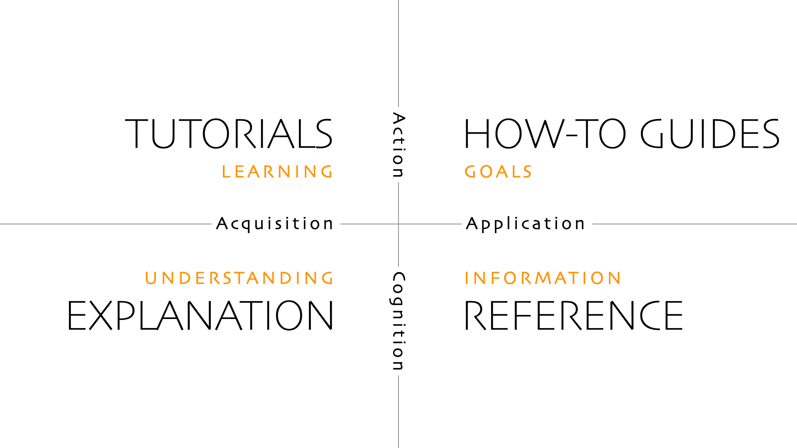

# Diataxis

*A systematic approach to technical documentation authoring.*

Source: [diataxis.fr](https://diataxis.fr)

The core idea of Diataxis is that there are fundamentally **four identifiable
kinds of documentation**, that respond to four different needs: 

- Tutorials

- HOWTO guides

- Reference

- Explanation

Each has a different purpose and needs to be written in a different way.

## Tutorials

A tutorial is **a lesson that takes a student by the hand** through a learning
experience. A tutorial is always practical: the user *does* something under the
guidance of an instructor. 

- A *driving lesson* is a good example of a tutorial. The purpose of the lesson
  is to develop skills and confidence in the student, not to get from A to B. 

- A software example could be: *Let’s create a simple game in Python*.

The user will learn through what they do - not because someone has tried to
teach them.

In documentation, the special difficulty is that the instructor is condemned to
be absent. He's not there to monitor the learner and correct their mistakes.
The instructor must somehow find a way to be present through written
instruction alone.

## HOWTO guides

A HOWTO guide **addresses a real-world goal or problem by providing practical
directions** to help the user who is in that situation.

A HOWTO guide always addresses an already competent user who is expected to
be able to use the guide to help them get their work done. In contrast to a
tutorial, a HOWTO guide is concerned with *work* rather than *study*.

A HOWTO guide might be: 

- How to store cellulose nitrate film in motion picture photography

- How to configure frame profiling in software.

- Troubleshooting deployment problems.

## Reference

Reference guides contain the **technical description** - facts - that a user
needs in order to do things correctly: accurate, complete, reliable
information, free of distraction and interpretation. They contain
*propositional or theoretical knowledge*, not guides to action.

Like a HOWTO guide, reference documentation serves the user who is at *work*,
and it’s up to the user to be sufficiently competent to interpret and use it
correctly.

Reference material is neutral. It is not concerned with what the user is doing.
A marine chart could be used by a ship’s navigator to plot a course, but
equally well by a prosecuting magistrate in a legal case.

## Explanation

Explanatory guides provide **context and background**. They serve the need to
understand and put things in a bigger picture. Explanation joins things
together and helps answer the question *why?*

Explanation often needs to circle around its subject and approach it from
different directions. It can contain opinions and take perspectives.

Like reference, explanation belongs to the realm of propositional knowledge
rather than action. However its purpose is to serve the user’s study - as
tutorials do - and not their work.

Often, writers of tutorials who are anxious that their students should know
things overload their tutorials with distracting and unhelpful explanation. It
would be much more useful to give the learner the most minimal explanation
(*“Here, we use HTTPS because it’s safer”*) and then link to an in-depth
article (*Secure communication using HTTPS encryption*) for when the user is
ready for it.

## The Diataxis map

The four kinds of documentation and the relationships between them can be
summarised in the Diataxis map.

Diataxis is not just a list of four different things, but a conceptual
arrangement of them. It shows how the four kinds of documentation are related
to each other, and distinct from each other.

Crossing or blurring the boundaries described in the map is at the heart of a
vast number of problems in documentation.

## The Diataxis compass

As you can see from the map:

- Tutorials and HOWTO guides are concerned with what the user *does*
  (**action**).

- Reference and explanation are about what the user *knows* (**cognition**).

On the other hand:

- Tutorials and explanation serve the *acquistion of skill* (the user’s
  **study**).

- HOWTO guides and reference serve the *application of skill* (the user’s
  **work**).

But a map doesn’t tell you what to *do* - it’s reference. To guide your action
you need a different sort of tool, in this case, a kind of Diataxis compass.

The compass is useful in two different ways.

When creating documentation, it helps clarify your own intentions and helps
make sure you’re actually doing what you think you’re doing.

When looking at documentation, it helps understand what’s going on in it and
makes problems stand out.

The compass is not nearly as eye-catching as the map, but when you’re at work
puzzling over a documentation problem it’s what will help you move forward.

| If the content informs | and serves the user's | then it must belong to a |
| ---------------------- | --------------------- | ------------------------ |
| action                 | acquisition of skill  | tutorial                 |
| action                 | application of skill  | HOWTO guide              |
| cognition              | application of skill  | reference                |
| cognition              | acquisition of skill  | explanation              |

